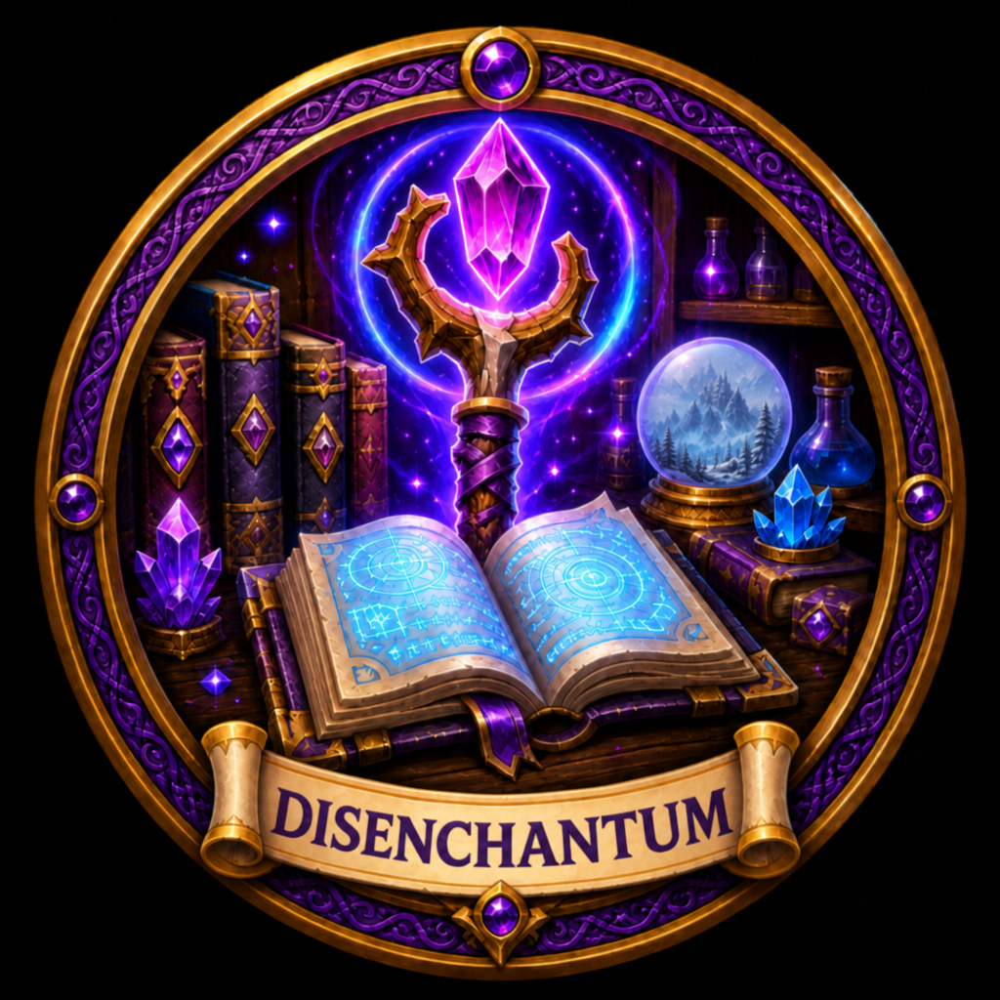

<!-- Improved compatibility of back to top link: See: https://github.com/othneildrew/Best-README-Template/pull/73 -->

[![Contributors][contributors-shield]][contributors-url]
[![Forks][forks-shield]][forks-url]
[![Stargazers][stars-shield]][stars-url]
[![Issues][issues-shield]][issues-url]
[![Discord][discord-shield]][discord-url]
[![License][license-shield]][license-url]
[![Ai][ai-shield]][ai-url]

<!-- PROJECT LOGO -->
 

  <a href="https://github.com/ZelionGG/Disenchantum">
    <kbd></kbd>
  </a>

  <h3 align="center">Disenchantum</h3>

  

    Queue bag items and disenchant them with one secure click per item.
     
     
    <a href="https://github.com/ZelionGG/Disenchantum/issues">Report Bug</a>
    ·
    <a href="https://github.com/ZelionGG/Disenchantum/issues">Request Feature</a>
  

<!-- TABLE OF CONTENTS -->

  
Table of Contents

  <ol>
    <li><a href="#download">Download</a></li>
    <li><a href="#about-the-project">About The Project</a></li>
    <li><a href="#slash-commands">Slash Commands</a></li>
    <li><a href="#features">Features</a></li>
    <li><a href="#localization">Localization</a></li>
    <li><a href="#contributing">Contributing</a></li>
    <li><a href="#license">License</a></li>
  </ol>

## Download

(<a href="#readme-top">back to top</a>)

<!-- ABOUT THE PROJECT -->
## About The Project

Disenchantum is a World of Warcraft Enchanting helper. It lists disenchantable items from your bags, lets you queue the ones you want, and casts [Disenchant](https://www.wowhead.com/spell=13262) through a button.

The addon is meant to stay out of the way while you work a bag of greens, blues and purples:
- Scan bags for items that can be disenchanted
- Filter by quality, expansion, and item level grouping
- Queue, reorder, ignore, and confirm crafted gear
- Cast from a dedicated window, the minimap, or the Enchanting profession frame

(<a href="#readme-top">back to top</a>)

## Slash Commands
* __/de__ - shows/hides the window
* __/disenchantum__ - same as `/de`

A keybind is also available: **Disenchant next queued item**.

(<a href="#readme-top">back to top</a>)

## Features

### Queue and cast
- Bag list of disenchantable items matching your filters
- Click to queue, drag queued rows to reorder, **Add all** / **Clear**
- One **Disenchant** click per item
- Optional auto-loot of reagents after each cast
- Session recap with items disenchanted and reagent chips

### Filters and ignore
- Quality filters (Uncommon, Rare, Epic)
- Expansion filters, including current expansion only
- Order and group bags by name, item level, quality, or armor type
- Search bags by name, slot, bind, item level, or expansion; Add all uses the same list
- Right-click to ignore an item (hidden from Bags and Add all)
- Confirmation before queueing crafted gear

### Access
- Minimap button and addon compartment icon
- Extra tab on the Enchanting profession window
- In-window changelog

(<a href="#readme-top">back to top</a>)

## Localization

- [ZelionGG](https://github.com/ZelionGG) - French Localization

Help wanted on the other locales. Open a pull request, or see [issue #1](https://github.com/ZelionGG/Disenchantum/issues/1). You can also reach me on [Discord](https://discord.gg/g7JZNGSU32) or [X (Twitter)](https://twitter.com/ZelionGG).

(<a href="#readme-top">back to top</a>)

<!-- CONTRIBUTING -->
## Contributing

Contributions are what make the open source community such an amazing place to learn, inspire, and create. Any contributions you make are **greatly appreciated**.

If you have a suggestion that would make this better, please fork the repo and create a pull request. You can also simply open an issue with the tag "enhancement".

1. Fork the Project
2. Create your Feature Branch (`git checkout -b feature/AmazingFeature`)
3. Commit your Changes (`git commit -m 'Add some AmazingFeature'`)
4. Push to the Branch (`git push origin feature/AmazingFeature`)
5. Open a Pull Request

**This addon is Retail only.** Please include the Disenchantum version and a Lua error dump when you report a bug.

(<a href="#readme-top">back to top</a>)

<!-- LICENSE -->
## License

Distributed under the All Rights Reserved License. See `LICENSE` for more information.

(<a href="#readme-top">back to top</a>)

## Stars

[contributors-shield]: https://img.shields.io/github/contributors/ZelionGG/Disenchantum.svg?style=for-the-badge
[contributors-url]: https://github.com/ZelionGG/Disenchantum/graphs/contributors
[forks-shield]: https://img.shields.io/github/forks/ZelionGG/Disenchantum.svg?style=for-the-badge
[forks-url]: https://github.com/ZelionGG/Disenchantum/network/members
[stars-shield]: https://img.shields.io/github/stars/ZelionGG/Disenchantum.svg?style=for-the-badge
[stars-url]: https://github.com/ZelionGG/Disenchantum/stargazers
[issues-shield]: https://img.shields.io/github/issues/ZelionGG/Disenchantum.svg?style=for-the-badge
[issues-url]: https://github.com/ZelionGG/Disenchantum/issues
[discord-shield]: https://img.shields.io/badge/Discord-7289DA?style=for-the-badge&logo=discord&logoColor=white
[discord-url]: https://discord.gg/g7JZNGSU32
[license-shield]: https://img.shields.io/badge/License-All%20Rights%20Reserved-red.svg?style=for-the-badge
[license-url]: https://github.com/ZelionGG/Disenchantum/blob/main/LICENSE
[Lua]: https://img.shields.io/badge/lua-000000?style=for-the-badge&logo=lua&logoColor=white
[Lua-url]: https://www.lua.org/
[ai-shield]: https://img.shields.io/badge/AI-AI_Assisted-yellow?style=for-the-badge
[ai-url]: https://www.aihonestybadge.com/